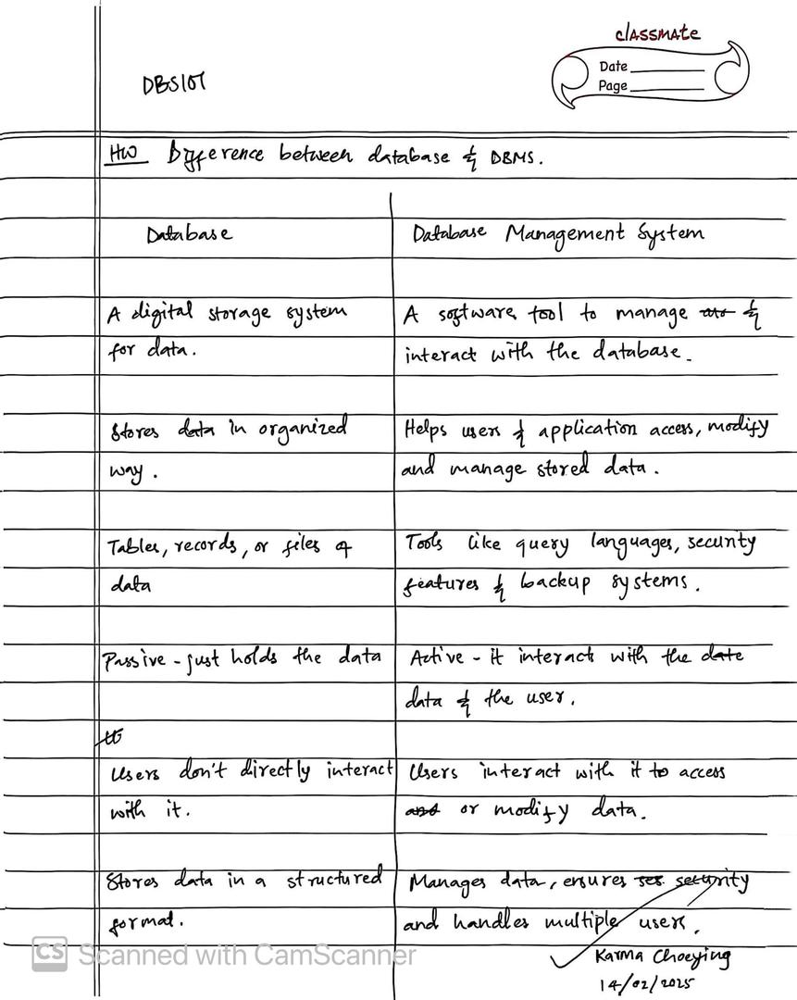
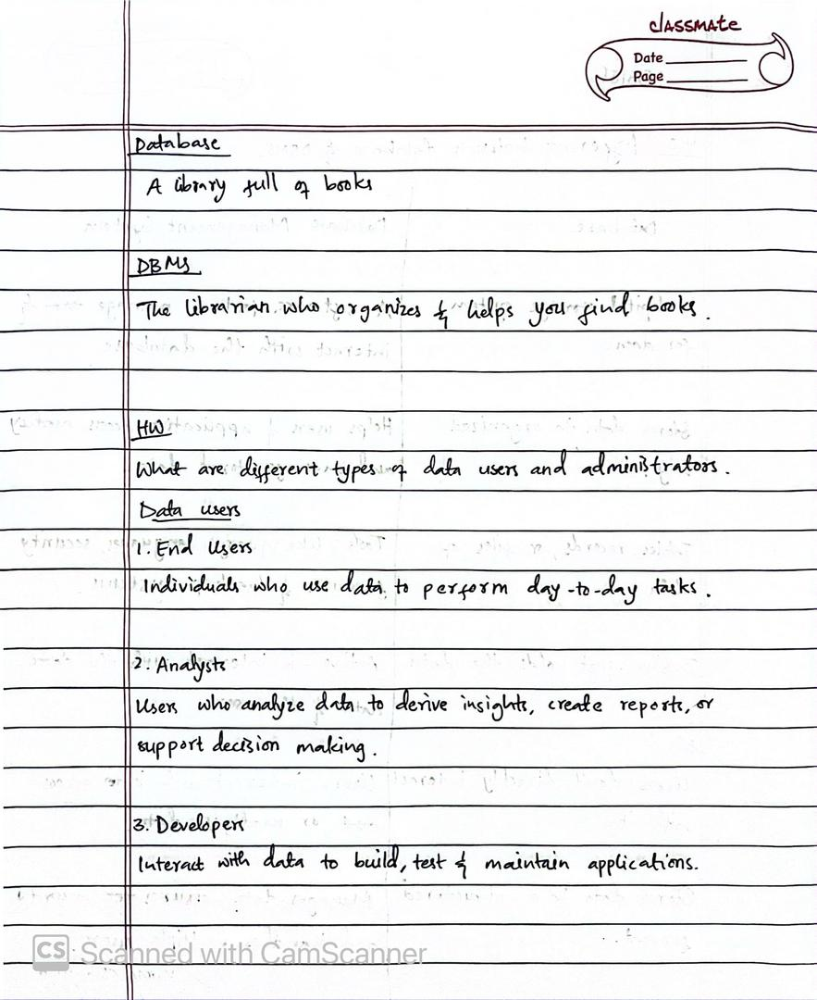
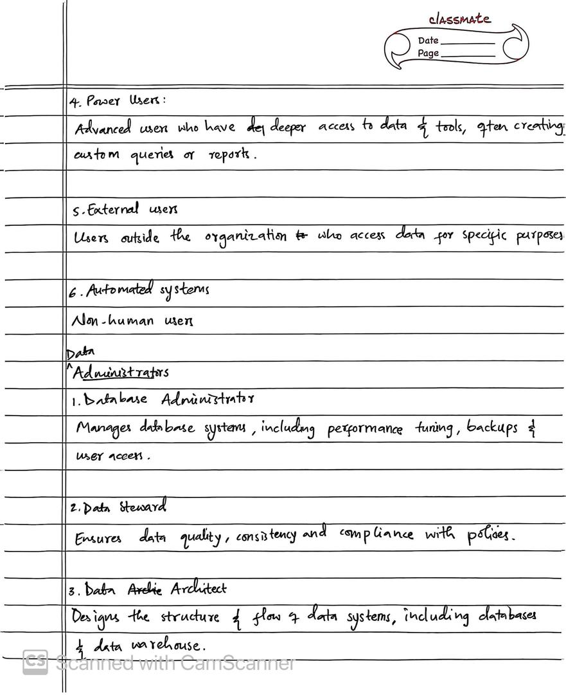
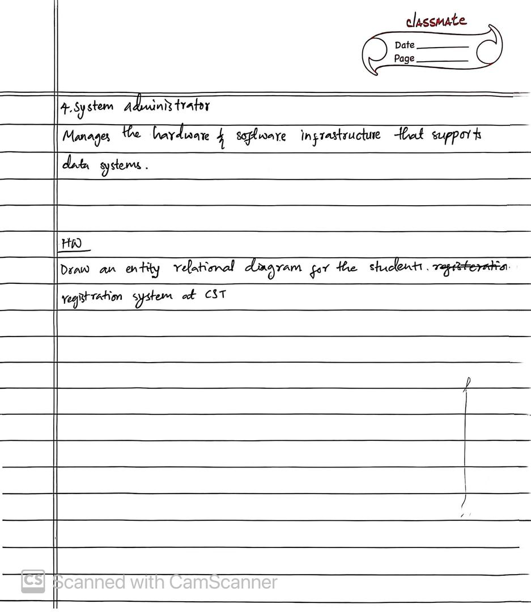
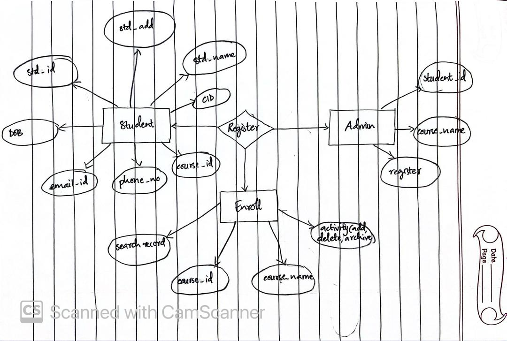

# Unit 1: Database Systems Fundamentals

## Reflections on Unit 1 Lesson 1

I’ve learned that a database is essentially an organized collection of data, usually stored electronically. It’s fascinating how a Database Management System (DBMS) works as a bridge, allowing us to access and manage this data efficiently.

## Key Takeaways

**Purpose of Database Systems:** I now understand that these systems are crucial for organizing and retrieving data effectively.

**Industry Applications:** It’s interesting to see how various industries, from banking to social media, rely on database systems to manage their data.

**Evolution:** The history of database systems shows how far we’ve come and hints at the exciting future developments in this field.

## Why Database Systems Matter ?

I realized that traditional methods of data management, like using physical forms and separate records, can be inefficient. For example, the college registration process highlighted how hectic it can be.

**Advantages of Database Systems:**

- They ensure data consistency.
- They offer scalability and flexibility.
- They reduce data redundancy, which is a huge plus.
- They enhance security and provide better data abstraction.

**Challenges with File-Processing Systems**

I noted several disadvantages, such as:
- Data redundancy and inconsistency.
- Difficulty in accessing data.
- Integrity and security issues.

**Real-World Applications**

It’s clear that database systems are everywhere! They’re used in banking for transaction processing, in social media for managing user data, and even in navigation systems.

**The Value of Data**

The phrase "Data is the new gold" really resonates with me. It emphasizes how important it is to manage data well, as it can lead to better decision-making and insights.

**Conclusion**
Overall, I’ve come to appreciate how essential database systems are for managing data efficiently and securely. Understanding their purpose and applications can significantly enhance operations in various sectors.

## Reflections on UNIT 1 Lesson 2

# Homeworks

